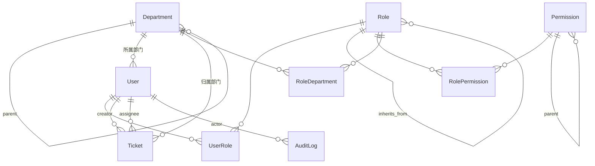

# 设计文档：企业后台 RBAC 权限系统

| 项 | 值 |
| --- | --- |
| 文档版本 | v1.0 |
| 状态 | 已定稿 |
| 最后更新 | 2026-07-31 |
| 关联文档 | [00-RBAC理论基础.md](00-RBAC理论基础.md)（前置阅读）、[01-PRD.md](01-PRD.md)、[03-实施计划.md](03-实施计划.md) |

> **本文档的读法**
> 第 2 章「架构决策记录（ADR）」是全文核心，共 16 条。每条都按「问题 → 候选方案 → 决定 → 理由 → 代价」的结构写。
> **代价那一节请务必读。** 任何声称「没有代价」的设计决策都是没想清楚。

---

## 1. 架构总览

### 1.1 分层

```
┌─────────────────────────────────────────────────────────────┐
│  表现层                                                       │
│  ┌──────────────────────────┐  ┌──────────────────────────┐  │
│  │ Web（Django 模板+Tailwind）│  │ API（DRF + JWT）阶段二     │  │
│  │  · @require_perm 装饰器    │  │  · HasPerm 权限类         │  │
│  │  · PermRequiredMixin      │  │  · ScopedQuerysetMixin    │  │
│  │  ·   │  │  · /auth/profile          │  │
│  └────────────┬─────────────┘  └────────────┬─────────────┘  │
└───────────────┼─────────────────────────────┼────────────────┘
                │                             │
                └──────────────┬──────────────┘
                               ▼
┌─────────────────────────────────────────────────────────────┐
│  权限内核  apps/rbac/services.py                              │
│  纯函数，不认识 request / response / HTTP                      │
│                                                              │
│   get_user_perm_codes(user)      -> set[str]                 │
│   user_has_perm(user, code)      -> bool                     │
│   get_user_menu_tree(user)       -> list[dict]               │
│   build_scope_q(user, scope_cfg) -> Q | None                 │
│   expand_roles(roles)            -> set[Role]                │
└───────────────┬─────────────────────────────┬───────────────┘
                ▼                             ▼
┌───────────────────────────┐  ┌──────────────────────────────┐
│  数据层                     │  │  缓存层                        │
│  Department / Role /       │  │  两级：请求级 dict              │
│  Permission / UserRole /   │  │      + Django cache（版本号）   │
│  RolePermission / Ticket   │  │                               │
└───────────────────────────┘  └──────────────────────────────┘
```

**这个分层的唯一目的**：让「权限怎么算」这件事只存在一处。Web 层和 API 层都是薄适配器，它们负责把 HTTP 世界的东西（request.user、URL 参数）翻译成内核认识的参数，然后把内核的返回值翻译回 HTTP 世界（403 页面 / 403 JSON）。

### 1.2 应用划分

```
config/                  项目配置（settings 分层、urls、wsgi/asgi）
apps/
  common/                共享基类（TimestampedModel、TreeModel）、工具函数
  accounts/              组织域：User、Department
  rbac/                  授权域：Permission、Role、UserRole、RolePermission、权限内核
  tickets/               业务示例：Ticket
  audit/                 审计日志
static/ templates/       前端资源与模板
tests/                   测试
docs/                    文档
```

**依赖方向（严格单向）**：

```
tickets ──┐
audit   ──┼──> rbac ──> accounts ──> common
          │
          └──────────────────────────┘
```

反向依赖一律禁止（NFR-8）。这条约束的实际收益：`apps/rbac` 可以被整体复制到另一个项目里，只要那个项目有一个符合契约的 User 和 Department。

> **一处已知的妥协**：`rbac` 直接 `import` 了 `accounts.Department`（数据范围计算需要部门子树）。更纯粹的做法是让 rbac 通过 settings 配置一个「部门树提供者」接口来解耦。本项目**故意不这么做**，因为那层抽象在只有一个实现时是纯粹的负担。在 ADR-016 里详细讨论了这个取舍。

---

## 2. 架构决策记录（ADR）

### ADR-001：不使用 `django.contrib.auth.Permission`，自建权限模型

**问题**
Django 自带一套完整的权限系统：`Permission` 表、`Group` 表（可当角色用）、`user.has_perm('app.add_model')`。为什么不直接用？

**Django 自带方案的能力边界**

| 能力 | Django 自带 | 我们需要 |
| --- | --- | --- |
| 权限点定义 | 自动为每个模型生成 `add/change/delete/view` 四个 | 需要任意粒度，且很多权限不对应模型（「导出报表」「查看仪表盘」「审批」） |
| 权限点组织 | 平铺列表，无层级 | 必须是树（几百个权限点，平铺的多选框没法用） |
| 角色 | `Group`，无层级 | 需要继承（FR-3.2） |
| 数据权限 | 无 | 核心需求（FR-7） |
| 菜单信息 | 无 | 需要图标、路由、排序、可见性（FR-2.3） |
| 权限与模型的耦合 | 强绑定 `ContentType` | 不希望绑定 |

`Meta.permissions` 可以自定义权限点，但它仍然必须挂在某个模型下。当你要定义一个「查看营收看板」的权限时，你被迫去找一个模型来挂它，或者建一个空的 `Dashboard` 假模型——这是设计在抗议。

此外，`ContentType` 与 `Permission` 的联动在模型重命名/删除后会留下 stale 记录，是 Django 项目的经典噪音源。

**决定**
自建 `Permission`、`Role`、`UserRole`、`RolePermission` 四张表。
**但保留 Django 的认证框架**：`AbstractUser`、`authenticate()`、`login()`、session 中间件、`login_required`、密码哈希器全部照用。

同时实现一个自定义 authentication backend，把我们的权限接进 `user.has_perm()`：

```python
class RBACBackend(BaseBackend):
    def has_perm(self, user_obj, perm, obj=None):
        return user_has_perm(user_obj, perm)
```

**理由**
- 认证（你是谁）和授权（你能做什么）是两件事。Django 的**认证**做得很好，没有理由重写；Django 的**授权**是为它自己的 admin 设计的，撑不住企业后台的需求。
- 接进 `has_perm()` 让第三方代码（包括 Django admin 本身）仍然能工作，是低成本的兼容性投资。

**代价**
- 失去 Django admin 开箱即用的权限控制 → 但我们本来就要自己写权限管理界面。
- 有两套权限概念并存（`auth.Permission` 表仍然存在且被自动填充）→ 通过 backend 隔离，业务代码只接触我们的 API。可以在 settings 里移除 `ModelBackend` 避免混淆。
- 需要自己实现所有管理界面。**在教学项目里这不是代价，这是内容。**

---

### ADR-002：用 `AbstractUser` 自定义用户模型，且必须在第一次 migrate 之前

**问题**
Django 提供三种用户模型策略：直接用 `auth.User`、继承 `AbstractUser`、继承 `AbstractBaseUser`。选哪个？

**候选**

| 方案 | 得到什么 | 失去什么 |
| --- | --- | --- |
| 用 `auth.User` + 一对一 Profile 表 | 零改动 | 每次访问用户属性都要 join；`department` 这种高频字段放 Profile 里很别扭 |
| 继承 `AbstractUser` | 保留全部字段和认证逻辑，可自由加字段 | 继承了一些用不上的字段（`first_name`/`last_name`/`is_staff`） |
| 继承 `AbstractBaseUser` | 完全自由（比如用手机号登录） | 要自己实现 `UserManager`、权限 mixin、`REQUIRED_FIELDS` 等一堆样板 |

**决定**
继承 `AbstractUser`，新增 `real_name`、`phone`、`department`、`last_login_ip`。
**复用 Django 自带的 `is_superuser` 表示超级管理员**，不新增 `is_superadmin` 字段。

**理由**
- `AbstractUser` 是 95% 项目的正确答案。`AbstractBaseUser` 的自由度只在「登录标识不是用户名」时才值回票价。
- 复用 `is_superuser`：多一个语义重叠的字段，就多一处「两个字段不一致时听谁的」的 bug 温床。Django 生态（admin、`ModelBackend`）也认这个字段。

**⚠️ 这里有 Django 最著名的一个坑**

`AUTH_USER_MODEL` **必须在项目第一次 `migrate` 之前设定好**。一旦 `auth` 应用的迁移已经跑过，再换用户模型会遇到几乎无解的外键依赖问题（社区的标准建议是：删库重来）。

所以实施计划里 `v0.2.0`（自定义 User）排在任何 `migrate` 之前，`v0.1.0` 的验收标准里明确写了「**不要**执行 migrate」。这个顺序不是偶然，是刻意安排的教学点。

**代价**
- 继承来的 `first_name`/`last_name` 不符合中文姓名习惯 → 我们加 `real_name`，前两个字段留空不用。轻微冗余，可接受。
- `is_staff` 字段语义模糊（它只控制能否进 Django admin）→ 在代码注释里明确它与我们的权限体系无关。

---

### ADR-003：部门树用「邻接表 + 冗余路径字段」存储

**问题**
数据权限最核心的查询是：**给定一个部门，取出它及其所有后代部门的 ID 集合**。这个查询的性能和实现复杂度，取决于树怎么存。

**候选**

| 方案 | 取子树 | 插入/移动 | 依赖 | 备注 |
| --- | --- | --- | --- | --- |
| a. 纯邻接表 `parent_id` | 需递归，N 次查询或应用层递归 | O(1) | 无 | 最简单，但取子树是痛点 |
| b. 路径枚举 `path='/1/3/7/'` | **一次 `LIKE '/1/3/%'`** | 移动节点需更新整棵子树 | 无 | 读优化 |
| c. 闭包表（祖先-后代全对） | 一次 join | 插入 O(depth)，移动 O(子树×深度) | 无 | 读写都好，多一张表 |
| d. `django-mptt`（左右值） | 一次范围查询 | 需重排全表 lft/rgt，并发写有锁竞争 | 第三方 | 写重 |
| e. 递归 CTE | 一次递归查询 | O(1) | 数据库支持 | PG 好，SQLite 3.8.3+ 也支持但要写原生 SQL |

**决定**
**邻接表（`parent` 外键）+ 冗余的 `path` 字段（路径枚举）+ `depth` 字段**。

`path` 格式为 `/{根id}/{...}/{自身id}/`，例如根部门是 `/1/`，它的子部门是 `/1/3/`，孙部门是 `/1/3/7/`。

取子树：
```python
Department.objects.filter(path__startswith=dept.path, is_active=True)
```
这一条查询同时**包含自身**（因为自身的 path 就是前缀），正好符合「本部门及以下」的语义。

**理由**
部门树的负载特征非常明确：

- **读极多，写极少**：每次带数据权限的列表查询都要取子树；部门调整一年可能就几次。
- **规模小**：企业部门树通常 < 1000 节点，深度 < 10。
- **过滤要能下推到 SQL**：数据权限的 Q 对象里需要 `department_id__in=<子树ID集>`，路径枚举可以直接写成子查询，一条 SQL 完成（满足 NFR-2）。

在这个负载下，方案 b 的「写慢」缺点几乎不存在，而「读快 + 零依赖 + 实现简单」的优点全部兑现。方案 c/d 的额外复杂度买不到对应收益，方案 e 会绑定数据库（违反 NFR-10）。

**代价**
- `path` 是**冗余数据**，理论上可能与 `parent` 不一致（比如有人直接改数据库）。
  → 缓解：`path` 在 `save()` 中根据 `parent` 重算，永不手工赋值；提供 `python manage.py rebuild_dept_path` 全量重建命令。
- 移动部门需要递归更新整棵子树的 `path` 和 `depth`。
  → 缓解：写少；且实现上用一次 `filter(path__startswith=old_path)` 批量取出，在 Python 里做字符串替换后 `bulk_update`，仍是常数次查询。
- **SQLite 的 `LIKE` 默认对 ASCII 大小写不敏感**。我们的 path 只含数字和斜杠，不受影响；但如果将来 path 里放编码而非 ID，就要注意这一点。

**关于「一个用户只属于一个部门」**
PRD 的 FR-1.4 做了这个简化。真实企业存在兼岗（一人多部门），那时数据范围会从「一个部门子树」变成「多个部门子树求并」，`build_scope_q` 里要多一层循环。本项目不实现，但代码结构上留出了位置（`get_user_dept_ids(user)` 返回的是**集合**而非单值，将来改成多部门只需改这个函数）。

---

### ADR-004：权限码采用 `app:resource:action` 三段式，以「界面上可点的东西」为粒度

**问题**
权限码怎么命名？权限点切多细？

这是整个 RBAC 系统里**最容易做错、且最难返工**的决策。切粗了不够用，切细了没人维护得动，而且一旦上线就有存量数据，改不动。

**候选粒度**

| 粒度 | 例子 | 评价 |
| --- | --- | --- |
| 模块级 | `ticket` | 太粗。「能看工单」和「能删工单」是完全不同的授权 |
| 页面级 | `ticket:list`、`ticket:detail` | 不够。同一页面上「编辑」和「删除」需要区分 |
| **操作级** | `ticket:ticket:update` | ✅ 选这个 |
| 字段级 | `ticket:ticket:update:priority` | 太细。权限点数量爆炸（N 个模型 × M 个字段），管理界面不可用，且实现要侵入序列化层 |
| 数据行级 | 「工单 #123 的编辑权」 | 这是**数据权限**，不该混进功能权限（见 ADR-007） |

**决定**

格式：`{app}:{resource}:{action}`，全小写，词内用下划线。

```
system:user:view          查看用户列表
system:user:create        创建用户
system:role:assign_perm   给角色分配权限
ticket:ticket:export      导出工单
report:revenue:view       查看营收看板
```

- **第一段 `app`**：所属应用/模块，与 Django app 名对应。
- **第二段 `resource`**：受控资源。当 app 只有一个主资源时会出现 `ticket:ticket:` 这种重复，**接受它**——一致性比省几个字符重要。
- **第三段 `action`**：动词，取自受控词表：

  | action | 含义 |
  | --- | --- |
  | `view` | 查看（列表 + 详情） |
  | `create` | 新建 |
  | `update` | 修改 |
  | `delete` | 删除 |
  | `export` | 导出 |
  | `import` | 导入 |
  | `assign` | 分配（如派单） |
  | `assign_perm` | 分配权限 |
  | `audit` | 查看审计信息 |

**为什么是三段而不是两段**
两段式 `resource:action` 在系统长大后必然撞名：`system` 里有 `user`，`crm` 里也可能有 `user`（客户）。加 `app` 前缀是最低成本的命名空间。

**为什么不是四段**
四段（`app:module:resource:action`）在超大系统里有意义，但对本项目是过度设计，且每多一段，管理员的认知负担就上升一档。

**粒度原则：一个权限点 = 界面上一个可点的东西**

- 一个列表页 → 一个 `view` 权限
- 页面上每个操作按钮 → 一个权限
- 后端的每个写接口 → 至少一个权限

这个原则的好处是**可验证**：产品经理指着原型图上的一个按钮问「这个要不要单独控权」，答案总是明确的。

**权限点从代码声明，用命令同步入库**

每个 app 有一个 `permissions.py`：

```python
# apps/tickets/permissions.py
PERMISSIONS = [
    {"code": None, "name": "工单管理", "type": "catalog", "icon": "ticket", "order": 20, "children": [
        {"code": "ticket:ticket:view", "name": "工单列表", "type": "menu",
         "url_name": "tickets:list", "icon": "list", "order": 10, "children": [
            {"code": "ticket:ticket:create", "name": "新建工单", "type": "button", "order": 10},
            {"code": "ticket:ticket:update", "name": "编辑工单", "type": "button", "order": 20},
            {"code": "ticket:ticket:delete", "name": "删除工单", "type": "button", "order": 30},
            {"code": "ticket:ticket:assign", "name": "派单",     "type": "button", "order": 40},
            {"code": "ticket:ticket:export", "name": "导出工单", "type": "button", "order": 50},
        ]},
    ]},
]
```

然后 `python manage.py sync_permissions` 幂等地同步进数据库。

**这一条比看起来重要得多。** 它带来三个收益：
1. **权限码在代码里可以被 grep**——排查「这个权限到底管什么」时，一次搜索直达使用点。
2. **杜绝手工录入的错别字**——`tickte:ticket:view` 这种 typo 会让权限永远匹配不上，且极难排查。
3. **权限点变更进入 code review 流程**——新增权限是一次代码提交，有人看，有记录。

配套用常量类避免视图里写裸字符串：
```python
class TicketPerm:
    VIEW = "ticket:ticket:view"
    CREATE = "ticket:ticket:create"
```

**代价**
- 新增权限点必须改代码 + 跑命令，管理员不能自助添加。**这是有意的**：能自助添加权限点，意味着可以添加一个代码里根本不检查的权限码，制造「配了但不生效」的幻觉。权限点的定义权应该在代码手里。
- `sync_permissions` 需要处理「代码里删掉了某个权限点，数据库里还有」的情形 → 标记为 `is_deprecated` 而非物理删除，保留历史授权记录的可解释性（FR-2.6）。

---

### ADR-005：菜单与权限点合并为一张表

**问题**
侧边栏菜单和权限点，是一个东西还是两个东西？

**候选**

| 方案 | 结构 | 评价 |
| --- | --- | --- |
| a. 分离 | `Menu` 表 + `Permission` 表 + 关联表 | 职责清晰，但要维护两棵树和它们的映射；角色配置要配两次（配菜单 + 配权限） |
| b. **合并** | 一张 `Permission` 表，`perm_type` 区分 `catalog`/`menu`/`button` | 一棵树，配一次 |

**决定**
合并。一张 `Permission` 表，三种节点类型：

```
📁 catalog（目录）  纯分组容器，无权限码，不可点击
  └─ 📄 menu（菜单）  对应一个页面，有权限码 + 路由 + 图标
       └─ 🔘 button（按钮）  对应页面内一个操作，只有权限码
```

**理由**
在实践中，「能看到菜单」和「有该页面的 view 权限」几乎总是同一件事。方案 a 的额外灵活性（同一菜单关联多个权限、同一权限出现在多个菜单）在真实项目里几乎用不上，却让管理员每次配角色都要做两遍勾选，还要理解两者的关系。

合并后，角色配置界面就是**一棵树**，管理员的心智模型是「勾选这个角色能看到和能做的东西」——直接、无歧义。

**代价**
`Permission` 表混进了 UI 关注点（`icon`、`url_name`、`is_visible`、`order_num`）。从领域建模的洁癖角度看，这是「授权模型污染」。

**我们接受这个污染，并且这是本项目最值得讨论的教学点之一：**

> 权限系统的用户是**管理员**，不是架构师。当领域纯洁性和管理便利性冲突时，选管理便利性。
> 一个"设计优雅但没人配得明白"的权限系统，最终的结局是所有人都被分配「超级管理员」——那才是真正的架构失败。

缓解措施：把 UI 字段集中在模型的一个区块并加注释标明「以下字段属于展示层关注点」，将来若要拆分，边界是清晰的。

---

### ADR-006：角色单继承，语义固定为「子角色 ⊇ 父角色」

**问题**
RBAC1 的核心是角色继承。但「继承」这个词在权限领域有两种相反的用法，必须先把语义钉死。

**语义歧义**

- 用法一（**本项目采用**）：`Role.parent` 指向被继承的角色。「客服主管」的 parent 是「客服专员」，主管**拥有**专员的全部权限。即 **child ⊇ parent**。
- 用法二：`parent` 指组织意义上的上级角色，权限反向流动。

这两种理解会导致完全相反的实现。**本项目固定采用用法一**，并在模型字段上直接改名以消除歧义：

```python
inherits_from = models.ForeignKey("self", ..., verbose_name="继承自",
                                  help_text="本角色将自动拥有所选角色的全部权限")
```

**单继承 vs 多继承**

| 方案 | 优点 | 缺点 |
| --- | --- | --- |
| 单继承（树） | 环检测简单；「这个权限从哪来的」可以一句话回答 | 表达力弱，无法「同时是 A 和 B」 |
| 多继承（DAG） | 表达力强，接近 NIST 标准的完整定义 | 环检测要跑 DFS；权限溯源变成路径搜索；管理员难以理解 |

**决定**
单继承，最大深度 5 层。

**理由**
- 「同时拥有 A 和 B 的权限」这个需求，在我们的模型里**已经被「用户可以有多个角色」满足了**（FR-4.1，权限取并集）。多继承是在角色层再做一次同样的事，收益重复。
- 单继承下，「为什么张三有这个权限」的答案永远是一条链：`张三 → 客服主管 → 客服专员 → [该权限]`。可解释性是权限系统的刚需——排查权限问题时，不可解释等于不可运维。

**环检测与深度限制**

```python
def validate_no_cycle(role, new_parent):
    seen, cur, depth = {role.pk}, new_parent, 0
    while cur is not None:
        if cur.pk in seen:
            raise ValidationError("检测到角色继承环")
        if depth >= MAX_ROLE_DEPTH:
            raise ValidationError(f"角色继承深度不得超过 {MAX_ROLE_DEPTH} 层")
        seen.add(cur.pk)
        cur = cur.inherits_from
        depth += 1
```

为什么要限制深度？不只是防御无限循环——**5 层以上的角色继承链，人已经无法在脑内推演了**。深度限制是在保护可运维性，不只是保护程序。

**代价**
- 表达力受限。若真出现「需要多继承」的场景，替代方案是给用户多分配几个角色。
- 深度 5 是拍脑袋定的经验值 → 做成 settings 配置项 `RBAC_MAX_ROLE_DEPTH`。

---

### ADR-007：数据权限用「枚举 data_scope」，多角色范围做真并集

**问题**
「客服主管只能看本部门及下属部门的工单」——这类需求怎么建模？

这是功能权限之外的另一个维度，也是绝大多数教学材料略过不讲的部分。

**先讲清楚两个维度的本质差异**

|  | 功能权限 | 数据权限 |
| --- | --- | --- |
| 回答的问题 | 能不能执行这个操作 | 能对哪些数据行执行 |
| 判断结果 | 布尔值 | 一个集合（SQL 的 WHERE 条件） |
| 检查时机 | 进入视图前 | 构造 QuerySet 时 |
| 实现位置 | 装饰器 / Mixin | Manager / QuerySet |
| 绕过的后果 | 垂直越权 | 水平越权 |

**它们必须分开实现。** 试图用一套机制同时表达两者，是权限系统腐化的头号原因。

**候选**

| 方案 | 说明 | 评价 |
| --- | --- | --- |
| a. **枚举 `data_scope`** | 角色上一个字段，取值为预定义的几种范围 | 可在界面配置；可翻译成 Q 对象下推 SQL；覆盖 ~90% 需求 |
| b. 表达式 / DSL | 每个角色配一段条件表达式 | 灵活，但管理员写不了；难保证能下推到 SQL，可能退化成全表扫描 |
| c. 完整 ABAC 策略引擎（OPA / Casbin） | 通用策略语言 | 强大，但它本身就是一个项目；且策略引擎通常在应用层求值，与「SQL 层过滤」的要求（NFR-2）天然冲突 |

**决定**
方案 a，五个枚举值。**枚举值刻意按「范围从大到小」编号**：

| 值 | 名称 | 含义 |
| --- | --- | --- |
| 1 | `ALL` | 全部数据 |
| 2 | `DEPT_AND_BELOW` | 本部门及下级部门 |
| 3 | `DEPT_ONLY` | 仅本部门 |
| 4 | `SELF_ONLY` | 仅本人创建/负责的 |
| 5 | `CUSTOM` | 自定义部门（勾选任意部门，含其子树） |

编号顺序不是随意的——它让「哪个范围更宽」变成一次整数比较，代码里到处受益。

**多角色的数据范围如何合并？**

这是最容易做错的地方。假设张三有两个角色：
- 角色 A：`SELF_ONLY`（仅本人）
- 角色 B：`CUSTOM`，自定义部门为 [市场部]

**错误做法**：取「最宽松」的枚举值。按编号，`CUSTOM`(5) 比 `SELF_ONLY`(4) 窄，于是取 `SELF_ONLY`——张三看不到市场部的数据了。**但他明明有一个角色授予了市场部的数据权限。** 这违反了 RBAC「多角色权限取并集」的基本原则。

**正确做法**：把每个角色的范围翻译成 Q 对象，用 `OR` 连起来求真并集：

```python
q = Q(creator=user) | Q(department_id__in=市场部子树ID集)
```

**决定：实现真并集**，同时做一个短路优化——只要任一角色是 `ALL`，直接返回 `None`（表示不过滤），跳过其余计算。

**⚠️ 无角色时必须返回空集，不是全集**

```python
if not roles:
    return Q(pk__in=[])   # 默认拒绝
```

这行代码看起来微不足道，但把 `Q(pk__in=[])` 写成 `Q()` 就是一个「新用户能看到全公司数据」的严重漏洞。**默认拒绝（deny by default）是权限系统的第一原则**，且必须有测试用例守住。

**业务模型如何接入**

每个受控模型声明自己的「归属字段」：

```python
class Ticket(DataScopedModel):
    class ScopeConfig:
        owner_field = "creator"       # SELF_ONLY 用它
        dept_field = "department"     # 各种部门范围用它
```

`build_scope_q()` 读这个配置来生成 Q 对象。接入成本 = 3 行（满足 FR-7.6）。

**代价**
- 灵活性不足。「只能看状态为待处理的工单」这类基于业务属性的范围，枚举表达不了。
  → 留扩展点：`ScopeConfig` 可以定义 `extra_q(user)` 钩子返回附加 Q。这是通往 ABAC 的门，但我们只开一条缝。
- `CUSTOM` 范围下角色关联的部门集合需要额外一张 `RoleDepartment` 表和一次查询 → 用角色级缓存缓解。

---

### ADR-008：功能权限校验用装饰器/Mixin，不用中间件；用启动自检兜底

**问题**
权限检查的代码放在哪？

**候选**

| 方案 | 优点 | 缺点 |
| --- | --- | --- |
| a. 中间件统一拦截 | 无法遗漏，集中管理 | 需要维护 URL→权限码 的映射表，该表极易与实际视图脱节；含路径参数的 URL 匹配麻烦；中间件运行在 URL resolve 之后但视图之前，拿 view 的元信息要用 `process_view`，可读性差 |
| b. **装饰器 / Mixin** | 权限声明就写在视图旁边，**代码即文档**；改视图时不会漏改权限 | 可能忘记加 |
| c. 每个视图内部手写 `if not user_has_perm(...)` | 最灵活 | 重复代码，且必然有人忘记 |

**决定**
方案 b 为主，并用**启动时自检**弥补它「可能忘记加」的唯一缺点。

```python
# 函数视图
@require_perm(TicketPerm.CREATE)
def ticket_create(request): ...

# 类视图
class TicketListView(PermRequiredMixin, ListView):
    required_perm = TicketPerm.VIEW

# 显式声明「本视图无需权限」——不是省略，是声明
@public_view(reason="登录页，未认证用户可访问")
def login_view(request): ...
```

**启动自检（FR-6.6）**

```python
def check_view_permissions(app_configs, **kwargs):
    """遍历 URLConf，找出既没有权限声明、也没有 @public_view 标记的视图。"""
    for view in iter_all_views():
        if not hasattr(view, "_required_perm") and not getattr(view, "_is_public", False):
            yield Warning(f"视图 {view} 未声明权限要求", id="rbac.W001")
```

注册为 Django 的 system check，`runserver` 和 `check` 时自动运行。

**这个自检是本设计的关键一环，值得单独强调：**

> **默认拒绝需要机制来保证，不能靠开发者的自觉。**
> 装饰器方案的风险是「忘了加」，而「忘了加」的后果是接口裸奔。既然风险已知，就必须有机制把它变成**编译期/启动期可见**的错误，而不是等着线上被人发现。
>
> 这也是为什么我们要求 `@public_view` 显式声明而不是默认放行——**沉默不能被解释为同意**。

**代价**
- 每个视图多一行装饰器。这不是负担，是文档。
- 自检需要遍历 URLConf 并穿透 Django 的各层包装（`as_view()` 返回的闭包、`csrf_exempt` 等装饰器链）→ 需要一点反射技巧，代码约 40 行，在 v0.9.0 里详细讲解。

**API 阶段的处理**
DRF 用 `permission_classes = [HasPerm(TicketPerm.VIEW)]`，内部调用同一个 `user_has_perm()`。**不重复实现任何判断逻辑**（FR-10.3）。

---

### ADR-009：数据权限通过显式的 `.for_user()` 注入，坚决拒绝隐式过滤

**问题**
数据范围的 Q 对象怎么作用到查询上？

**候选**

| 方案 | 写法 | 评价 |
| --- | --- | --- |
| a. **自定义 QuerySet 方法** | `Ticket.objects.for_user(request.user)` | 显式，可测试，可组合 |
| b. 重写默认 Manager 的 `get_queryset()`，从 thread-local 取当前 user 自动过滤 | `Ticket.objects.all()` 就已经过滤了 | 业务代码零改动，但…… |
| c. 视图 Mixin 自动在 `get_queryset()` 里调用 a | `class TicketListView(ScopedListMixin, ListView)` | 便利 |

**决定**
a + c。**明确反对 b。**

**为什么反对方案 b（隐式过滤）**

方案 b 看起来最优雅——业务开发者什么都不用想，写 `Ticket.objects.all()` 就自动安全了。但它在实践中是**生产事故的常见来源**：

1. **Celery 任务、管理命令、定时脚本里没有 request**。thread-local 是空的，此时行为是什么？返回全集（危险）还是空集（任务全挂）？两个答案都不对。
2. **测试中行为诡异**。测试里没有 request，要么每个测试都要 mock thread-local，要么测试跑的根本不是生产路径。
3. **异步（ASGI）下 thread-local 语义崩坏**。Django 5.2 的 async view 中，同一线程可能服务多个并发请求，thread-local 会串。要改用 `contextvars`，但第三方库不一定配合。
4. **最根本的问题：它让「这个查询有没有被过滤」变得不可见。** 读代码时看到 `Ticket.objects.all()`，你无法判断它到底返回什么。而权限系统里，**看不见 = 审计不了 = 不可信**。

> **显式优于隐式**——这条 Python 之禅，在安全相关的代码里不是风格偏好，是硬要求。
> 你应该能通过 `grep` 找出所有绕过数据权限的查询。方案 b 让这件事变得不可能。

**实现**

```python
class DataScopedQuerySet(models.QuerySet):
    def for_user(self, user):
        q = build_scope_q(user, self.model.ScopeConfig)
        return self if q is None else self.filter(q)

class Ticket(models.Model):
    objects = DataScopedQuerySet.as_manager()
```

**单条记录的获取必须走同一条路（FR-7.4）**

```python
# ✅ 正确：数据范围内找不到就是 404
ticket = get_object_or_404(Ticket.objects.for_user(request.user), pk=pk)

# ❌ 错误：先取出再判断，是 IDOR 漏洞的标准写法
ticket = get_object_or_404(Ticket, pk=pk)
if ticket.department != request.user.department:
    raise PermissionDenied
```

错误写法有两个问题：一是判断逻辑重复实现且容易和数据范围规则不一致；二是返回 403 会泄露「这条记录存在」的信息。**统一返回 404**——用户不该知道自己看不见的东西是否存在。

**代价**
- 业务开发者可能忘记调用 `.for_user()`。
  → 缓解三重：`ScopedListMixin` 让常规列表视图自动接入；测试用例覆盖每个业务端点的越权场景；code review 检查清单。
  → **不缓解的部分要诚实承认**：这个方案确实换不来「不可能出错」的保证。它换来的是「出错时能被看见」。在安全工程里，可观测的风险优于隐形的保证。

---

### ADR-010：权限缓存用「全局版本号」失效，配合请求级缓存

**问题**
一次权限判断要查：`UserRole` → `Role` → 递归 `inherits_from` → `RolePermission` → `Permission`，至少 4~5 次查询。一个页面渲染可能判断几十次权限（每个按钮一次）。不缓存不可用（NFR-1）。

**两级缓存**

| 层级 | 存储 | 生命周期 | 解决什么 |
| --- | --- | --- | --- |
| L1 请求级 | `request` 对象上的属性 | 单次请求 | 同一请求内的重复判断（渲染 50 个按钮只算一次） |
| L2 进程外 | Django cache（LocMem / Redis） | TTL 30 分钟 | 跨请求复用 |

L1 是零成本的纯收益，没有取舍可言。真正的问题在 L2 的**失效**。

**失效难题**

管理员修改了「客服专员」角色的权限。需要失效谁的缓存？

- 所有直接拥有「客服专员」的用户
- 所有拥有「客服主管」的用户（因为主管继承自专员）
- 所有拥有任何间接继承「客服专员」的角色的用户

要逐个删 key，就得先反查出这批用户 ID——一次可能涉及数千用户的查询，而且这个反查逻辑本身就容易写漏（尤其是继承链那部分）。

**候选**

| 方案 | 说明 | 评价 |
| --- | --- | --- |
| a. 逐 key 删除 | 反查受影响用户，逐个 `cache.delete` | 精确，但反查昂贵且易漏 |
| b. **全局版本号** | key 里带版本号，任何变更就 `incr` 版本 | 简单、绝不漏；但全体缓存一起失效 |
| c. 按角色分级版本号 | 每个角色一个版本号，key 由涉及的角色版本组合而成 | 精确 + 不易漏，但 key 构造复杂 |
| d. 只靠 TTL | 不主动失效 | 违反 FR-4.5（变更需下一次请求生效） |

**决定**
方案 b。

```python
def _version():
    return cache.get_or_set(RBAC_VERSION_KEY, 1, None)

def bump_version():
    """任何权限相关变更后调用：角色权限变更、用户角色变更、角色继承变更、权限点同步。"""
    try:
        cache.incr(RBAC_VERSION_KEY)
    except ValueError:          # key 不存在
        cache.set(RBAC_VERSION_KEY, 1, None)

def get_user_perm_codes(user):
    key = f"rbac:perms:{user.pk}:{_version()}"
    ...
```

版本号一变，所有旧 key 立刻不可达，靠 TTL 自然淘汰。

**理由**
- **绝不会漏失效。** 这是安全属性——漏失效意味着「权限已撤销但仍然生效」，是严重问题。方案 a 的精确性买不到这个保证。
- 代价可量化：企业后台的权限变更是**低频**操作（一天几次到几十次），用户数千级。一次全量失效造成的后果是接下来几分钟内缓存命中率下降、数据库多扛一批查询——完全在承受范围内。

**教学要点：这是一个「用可量化的性能损失，换不可量化的正确性保证」的典型交换。** 在安全相关的设计里，这个方向的交换几乎总是对的。反过来（为了性能牺牲正确性）几乎总是错的。

**代价**
- 缓存"抖动"：任何一个用户的授权变更会导致全体缓存失效。
  → 若用户量到十万级，升级到方案 c（按角色分级版本号）。文档在 v0.16.0 里给出方案 c 的设计草图，作为进阶练习。
- 需要保证**每一个**变更入口都调用 `bump_version()`。
  → 用 Django signal（`post_save`/`post_delete`/`m2m_changed`）挂在相关模型上，而不是靠在每个视图里手写调用。信号在这里是恰当的用法：它天然是「横切关注点」，且不能被遗漏。

**超级管理员的缓存**
超管在 `user_has_perm` 的第一行就短路返回 `True`，根本不进缓存路径。

---

### ADR-011：超级管理员是逃生舱，必须受约束

**决定**
复用 Django 的 `is_superuser`：

```python
def user_has_perm(user, code):
    if not user.is_authenticated or not user.is_active:
        return False
    if user.is_superuser:
        return True          # 短路：绕过全部功能权限
    return code in get_user_perm_codes(user)

def build_scope_q(user, cfg):
    if user.is_superuser:
        return None          # 短路：绕过全部数据权限
    ...
```

**但超管必须受三条约束**

1. **不能通过 Web 界面创建或提升超管。** 只能 `python manage.py createsuperuser`。
   *为什么*：如果「用户管理」页面上有一个「超级管理员」勾选框，那么任何拥有 `system:user:update` 权限的人都可以把自己提升为超管——这是**教科书级的垂直越权**。用户编辑表单必须显式排除 `is_superuser` 字段，并有测试用例守住（即使有人构造 POST 请求塞进这个字段也不生效）。

2. **超管的所有操作必须审计。** 超管绕过权限检查，审计日志是唯一的事后追溯手段。

3. **超管的"绕过"行为必须被显式测试。** 不能假设它自然成立——它是短路逻辑，一旦被后续重构破坏，测试是唯一的守门人。

**代价**
- 超管是一个不受约束的账号，本身就是风险。生产环境的标准做法是：超管账号平时禁用，需要时临时启用并全程录屏；或采用「双人授权」机制。本项目不实现这些，但**必须知道它们存在**。

---

### ADR-012：模板层用 context processor 注入惰性 `perms` 对象

**问题**
模板里怎么写「有权限才渲染这个按钮」？

**候选**

| 方案 | 写法 |
| --- | --- |
| a. 自定义 template tag | `...` |
| b. 自定义 filter | `` |
| c. **context processor 注入集合** | `` |

**决定**
方案 c。

```python
# apps/rbac/context_processors.py
def rbac(request):
    return {
        "perms": LazyPermSet(request),      # 支持 in 运算
        "menu_tree": SimpleLazyObject(lambda: get_user_menu_tree(request.user)),
    }
```

```django

  <button class="rounded bg-red-600 px-3 py-1.5 text-sm text-white hover:bg-red-700">删除</button>

```

**理由**
- `in` 是 Django 模板原生支持的运算符，不需要 ``，模板作者零学习成本。
- 与 Django 自带的 `{{ perms.app.codename }}` 心智一致，迁移过来的人不会困惑。
- 惰性求值：`LazyPermSet.__contains__` 第一次被调用时才真正解析权限。未登录页面、静态页面完全不触发查询。

**⚠️ 必须反复强调的一点**

> **模板里隐藏按钮不是安全措施。** 它是**体验优化**——让用户不去点一个必然失败的东西。
>
> 真正的安全边界只有一个：**服务端视图层的权限校验**（ADR-008）。
>
> 每一个受权限控制的按钮，都必须有一个对应的服务端检查。二者成对出现，缺一不可。

这一点会在代码注释、文档和测试用例里出现多次。不是啰嗦——这是权限系统里最高频的真实漏洞成因。攻击者不需要点击你的按钮，他直接 POST。

**代价**
- context processor 对**每个**模板渲染都执行 → 靠 `SimpleLazyObject` 把成本降到「不用就不花钱」。
- 模板里写裸字符串权限码，typo 不会报错只会静默不渲染。
  → 缓解：`sync_permissions` 命令附带一个 `--check-templates` 选项，扫描模板中出现的权限码字面量，报告数据库里不存在的（v1.0.0 实现）。

---

### ADR-013：权限内核与表现层解耦，让模板和 API 共用同一套判断

**问题**
PRD 要求阶段一做服务端渲染，阶段二做 API（FR-10）。怎么保证不写两遍鉴权？

**决定**
权限内核（`apps/rbac/services.py`）是**纯函数模块**，不 import 任何 `django.http` 的东西，不认识 request、response、status code。

```python
# apps/rbac/services.py —— 内核的完整公开接口
def get_user_perm_codes(user) -> set[str]: ...
def user_has_perm(user, code: str) -> bool: ...
def user_has_any_perm(user, codes: Iterable[str]) -> bool: ...
def get_user_menu_tree(user) -> list[dict]: ...
def expand_roles(roles: Iterable[Role]) -> set[Role]: ...
def build_scope_q(user, scope_cfg) -> Q | None: ...
def get_user_dept_ids(user, include_children: bool) -> set[int]: ...
```

两个表现层各写一个薄适配器：

```python
# Web 层  apps/rbac/decorators.py
def require_perm(code):
    def deco(view):
        @wraps(view)
        def wrapper(request, *a, **kw):
            if not user_has_perm(request.user, code):
                raise PermissionDenied          # → 403.html
            return view(request, *a, **kw)
        wrapper._required_perm = code           # 供启动自检读取
        return wrapper
    return deco

# API 层  apps/rbac/api/permissions.py（阶段二）
class HasPerm(BasePermission):
    def has_permission(self, request, view):
        code = getattr(view, "required_perm", None)
        return code is None or user_has_perm(request.user, code)   # → 403 JSON
```

**验证这个设计是否成功的标准**：阶段二（v1.1.0~v1.2.0）加入 DRF 时，`services.py` **一行都不用改**。如果需要改，说明内核里漏进了表现层的关注点。这是一个可检验的架构承诺，实施计划里把它写成了 v1.2.0 的验收条件。

**`/api/auth/profile` 接口**
前后端分离时，前端需要一次性拿到权限码列表和菜单树来渲染路由和菜单：

```json
{
  "user": {"id": 3, "username": "zhangsan", "real_name": "张三", "department": "客服部"},
  "perms": ["ticket:ticket:view", "ticket:ticket:create"],
  "menus": [{"name": "工单管理", "icon": "ticket", "children": [...]}]
}
```

它直接调用 `get_user_perm_codes()` 和 `get_user_menu_tree()`——和模板层调的是同一个函数。

---

### ADR-014：默认 SQLite，保持数据库可移植

**决定**
默认 SQLite；通过环境变量 `DATABASE_URL` 切换 PostgreSQL。数据模型**不使用任何数据库特有字段**。

**理由**
教学项目的第一优先级是**可复现**。`git checkout v0.7.0 && python manage.py migrate && runserver` 必须直接能跑，不能要求先装个数据库。SQLite 做到了这一点。

**为可移植性付出的具体约束**

| 不用 | 用什么替代 | 原因 |
| --- | --- | --- |
| `ArrayField` | 关联表（`RoleDepartment`） | PG 特有 |
| `JSONField` 的复杂查询 | 只做整体读写（审计日志的 detail 字段） | 跨库行为差异大 |
| 数据库级递归 CTE | 冗余 `path` 字段（ADR-003） | SQLite 支持但需原生 SQL |
| `select_for_update` 的高级选项 | 基础用法 | SQLite 不支持行级锁 |

**SQLite 的坑（必须知道）**
- **无并发写**：整库写锁。教学够用，生产不行。
- `LIKE` 对 ASCII 默认大小写不敏感 → 我们的 `path` 只含数字和 `/`，不受影响。
- 无原生 `DecimalField` → Django 用 TEXT 模拟，精度计算需注意（本项目不涉及金额）。

**代价**
- 放弃了 PG 的一些好东西（`ArrayField` 存自定义部门列表会更简洁）。
- 用关联表替代 `ArrayField` 多一次 join。在部门数量级下可忽略。

---

### ADR-015：Tailwind 用 CLI 构建，产物提交进仓库

**问题**
Tailwind CSS 怎么接进 Django？

**候选**

| 方案 | 评价 |
| --- | --- |
| a. Play CDN（`<script src="cdn.tailwindcss.com">`） | 官方明确说明不适合生产；离线不可用；首屏有样式闪烁 |
| b. `django-tailwind` 包 | 封装了 Node 工具链，但多一层抽象，出问题难排查 |
| c. **Tailwind CLI + 产物提交进 Git** | ✅ |

**决定**
方案 c。`package.json` 里配 Tailwind CLI，构建产物 `static/css/tailwind.css` **提交进 Git**。

**理由（对教学项目是决定性的）**

> 学习者 `git checkout v0.8.0` 之后，必须**不需要 `npm install`** 就能看到正确的页面样式。

如果产物不入库，每切一个 tag 就要重跑一次前端构建，而不同 tag 的 `package.json` 可能还不一样——这会把「对比学习代码」变成「和前端工具链搏斗」。学习者的注意力是稀缺资源，不该花在这里。

```json
{
  "scripts": {
    "build:css": "tailwindcss -i ./static/src/input.css -o ./static/css/tailwind.css --minify",
    "watch:css": "tailwindcss -i ./static/src/input.css -o ./static/css/tailwind.css --watch"
  }
}
```

**代价**
- 仓库里有构建产物，`git diff` 会有噪音（一个压缩后的 CSS 文件，改一个 class 可能整行都变）。
  → 缓解：`.gitattributes` 里标记 `static/css/tailwind.css linguist-generated=true`；文档中给出排除它的 diff 命令：
  ```bash
  git diff v0.7.0 v0.8.0 -- ':!static/css/tailwind.css'
  ```
- 产物可能与源文件不同步（有人改了模板忘了重新构建）→ 提交前跑一次 `npm run build:css`，写进实施计划的每个 tag 的收尾步骤。

---

### ADR-016：`accounts` 与 `rbac` 分应用，但接受 rbac→accounts 的直接依赖

**问题**
`Department` 放哪个 app？角色/权限放哪个 app？

**分析**
- 用户和部门是**组织事实**：通讯录、报表、审批流都要用，它们和权限无关。
- 角色和权限是**授权概念**：它们的存在完全是为了访问控制。

两者属于不同的领域，应该分开。但数据权限的计算强依赖部门子树，于是 `rbac` 必须知道 `Department`。

**候选**

| 方案 | 说明 |
| --- | --- |
| a. Department 放 rbac | 让依赖方向变成 accounts→rbac，但部门明显不是授权概念 |
| b. **Department 放 accounts，rbac 直接 import** | 依赖方向正确，但存在具体类耦合 |
| c. Department 放 accounts，rbac 通过 settings 配置的「部门树提供者」接口访问 | 完全解耦 |

**决定**
方案 b。

**理由**
方案 c 更"正确"，但它引入的抽象层在**只有一个实现**的情况下是纯粹的负担：多一个接口定义、多一层间接调用、多一处配置、调试时多一次跳转。

> **抽象的成本是即时的，收益是推测的。** 当第二个实现真的出现时再抽象，代价通常比预付这笔成本更低。这是 YAGNI 原则在架构层面的应用。

我们**做了一件低成本的准备**：所有需要部门的地方都通过 `services.get_user_dept_ids(user, include_children)` 这一个函数，而不是散落各处的 `Department.objects.filter(...)`。将来若要抽象，改动面被收敛到了一个函数。

**代价**
- `apps/rbac` 不能脱离 `apps/accounts` 单独复用。这是清楚知道且接受的边界。

---

## 3. 数据模型

### 3.1 ER 图



### 3.2 表定义

#### `accounts_department`

| 字段 | 类型 | 约束 | 说明 |
| --- | --- | --- | --- |
| `id` | BigAuto | PK | |
| `code` | CharField(64) | unique | 部门编码，如 `CS` |
| `name` | CharField(64) | | 部门名称 |
| `parent` | FK(self) | null, on_delete=PROTECT | 上级部门 |
| `path` | CharField(255) | index | `/1/3/7/`，**由 save() 维护，禁止手工赋值** |
| `depth` | SmallInt | | 层级，根为 0 |
| `order_num` | SmallInt | default=0 | 同级排序 |
| `is_active` | Bool | default=True | |
| `created_at` / `updated_at` | DateTime | auto | |

> `on_delete=PROTECT`：有子部门时不能删（FR-1.2）。用 PROTECT 而不是在 `delete()` 里写检查，是因为数据库/ORM 层的约束比应用层的检查更难被绕过。

#### `accounts_user`（继承 `AbstractUser`）

| 字段 | 类型 | 说明 |
| --- | --- | --- |
| 继承字段 | | `username`(unique)、`password`、`email`、`is_active`、`is_staff`、`is_superuser`、`last_login`、`date_joined` |
| `real_name` | CharField(32) | 真实姓名 |
| `phone` | CharField(20) | 手机号 |
| `department` | FK(Department) | null, on_delete=PROTECT |
| `last_login_ip` | GenericIPAddress | null |

> `is_staff` 只控制能否登录 Django admin，与本系统的权限体系**无关**。代码里加注释说明，避免后人误用。

#### `rbac_permission`

| 字段 | 类型 | 约束 | 说明 |
| --- | --- | --- | --- |
| `id` | BigAuto | PK | |
| `code` | CharField(128) | unique, null | 权限码；`catalog` 类型为 null |
| `name` | CharField(64) | | 显示名 |
| `perm_type` | CharField(16) | choices | `catalog` / `menu` / `button` |
| `parent` | FK(self) | null, PROTECT | |
| `path` | CharField(255) | index | 同部门树 |
| `order_num` | SmallInt | | |
| **以下为展示层字段（ADR-005）** | | | |
| `url_name` | CharField(128) | blank | Django URL name，如 `tickets:list` |
| `icon` | CharField(64) | blank | 图标标识 |
| `is_visible` | Bool | default=True | 菜单是否在侧边栏显示 |
| **以下为状态字段** | | | |
| `is_active` | Bool | default=True | |
| `is_deprecated` | Bool | default=False | 代码中已移除但保留记录（FR-2.6） |

#### `rbac_role`

| 字段 | 类型 | 约束 | 说明 |
| --- | --- | --- | --- |
| `id` | BigAuto | PK | |
| `code` | CharField(64) | unique | 角色编码 |
| `name` | CharField(64) | | |
| `description` | TextField | blank | |
| `inherits_from` | FK(self) | null, PROTECT | **本角色拥有该角色的全部权限**（ADR-006） |
| `data_scope` | SmallInt | choices, default=4 | 1=全部 2=本部门及以下 3=本部门 4=仅本人 5=自定义 |
| `order_num` | SmallInt | | |
| `is_builtin` | Bool | default=False | 内置角色不可删除 |
| `is_active` | Bool | default=True | |

> `data_scope` 默认值取 **4（仅本人）** 而非 1（全部）。默认最小权限——新建角色时忘了配数据范围，后果应该是「看得太少」而不是「看得太多」。

#### `rbac_userrole`

| 字段 | 说明 |
| --- | --- |
| `user` FK, `role` FK | `unique_together` |
| `granted_by` FK(User), `granted_at` DateTime | 审计用：谁在什么时候授的权 |

#### `rbac_rolepermission`

| 字段 | 说明 |
| --- | --- |
| `role` FK, `permission` FK | `unique_together` |

> 只存**直接授予**的权限。继承来的权限在运行时计算，不落库。
> **为什么不把继承结果展开存下来（物化）？** 展开存储让查询变快一次，但代价是：父角色权限变更时要重算所有后代角色的物化数据，一旦这个重算漏了或失败，就出现「数据库里的权限和规则不一致」——而且这种不一致是**静默**的，没人会发现。运行时计算 + 缓存，用缓存版本号保证一致性（ADR-010），是更安全的组合。

#### `rbac_roledepartment`

| 字段 | 说明 |
| --- | --- |
| `role` FK, `department` FK | `unique_together`；仅 `data_scope=CUSTOM` 时有意义 |

#### `tickets_ticket`

| 字段 | 类型 | 说明 |
| --- | --- | --- |
| `title` | CharField(128) | |
| `content` | TextField | |
| `priority` | SmallInt | 1 低 / 2 中 / 3 高 |
| `status` | CharField(16) | `open` / `processing` / `closed` |
| `creator` | FK(User, PROTECT) | **数据权限的 owner_field** |
| `assignee` | FK(User, SET_NULL, null) | 处理人 |
| `department` | FK(Department, PROTECT) | **数据权限的 dept_field** |
| `created_at` / `updated_at` | DateTime | |

#### `audit_auditlog`

| 字段 | 类型 | 说明 |
| --- | --- | --- |
| `actor` | FK(User, SET_NULL, null) | 操作者；登录失败时可能为 null |
| `action` | CharField(64) | `login` / `login_failed` / `logout` / `role.update` / `perm.denied` … |
| `target_type` | CharField(64) | 目标对象类型 |
| `target_id` | CharField(64) | 目标对象 ID |
| `detail` | JSONField | 变更前后快照 |
| `ip` / `user_agent` | | |
| `result` | CharField(16) | `success` / `failure` |
| `created_at` | DateTime | index |

> 审计日志表**只写不改不删**（FR-9.4）。在模型上重写 `save()` 拒绝更新已有记录，`delete()` 直接抛异常。

---

## 4. 核心算法

### 4.1 角色展开（含继承链）

```python
MAX_ROLE_DEPTH = 5

def expand_roles(roles):
    """把直接角色集合展开为「直接角色 + 全部祖先角色」。

    单继承使得这是一次简单的向上遍历。visited 集合同时起到
    「防环」和「多角色共享祖先时去重」的作用。
    """
    result, stack = set(), list(roles)
    while stack:
        role = stack.pop()
        if role in result or not role.is_active:
            continue
        result.add(role)
        depth = 0
        cur = role.inherits_from
        while cur is not None and depth < MAX_ROLE_DEPTH:
            if cur in result:
                break                      # 已展开过，剪枝
            if cur.is_active:
                result.add(cur)
            cur = cur.inherits_from
            depth += 1
    return result
```

> **优化**：角色总数很少（几十个），一次性把全部激活角色加载进内存构建 `{id: role}` 映射并缓存，展开就变成纯内存操作，零 DB 查询。这个优化在 v0.16.0 引入。

### 4.2 有效权限解析

```python
def get_user_perm_codes(user):
    if not user.is_authenticated or not user.is_active:
        return frozenset()
    if user.is_superuser:
        return ALL_PERMS                      # 哨兵对象，__contains__ 恒为 True

    # L1：请求级缓存
    cached = getattr(user, "_perm_codes_cache", None)
    if cached is not None:
        return cached

    # L2：进程外缓存
    key = f"rbac:perms:{user.pk}:{_version()}"
    codes = cache.get(key)
    if codes is None:
        direct = Role.objects.filter(userrole__user=user, is_active=True)
        all_roles = expand_roles(direct)
        codes = frozenset(
            Permission.objects
            .filter(rolepermission__role__in=all_roles,
                    is_active=True, is_deprecated=False)
            .exclude(code__isnull=True)
            .values_list("code", flat=True)
        )
        cache.set(key, codes, RBAC_CACHE_TTL)

    user._perm_codes_cache = codes
    return codes
```

> 注意 `.exclude(code__isnull=True)`：`catalog` 类型的权限点没有权限码，不参与鉴权，只用于菜单分组。

### 4.3 数据范围 Q 对象构造

```python
def build_scope_q(user, cfg):
    """返回 Q 对象；返回 None 表示「不过滤」（全部数据）。

    cfg.owner_field: 归属人字段名，如 "creator"
    cfg.dept_field:  归属部门字段名，如 "department"
    """
    if not user.is_authenticated or not user.is_active:
        return Q(pk__in=[])                            # 默认拒绝
    if user.is_superuser:
        return None

    roles = expand_roles(Role.objects.filter(userrole__user=user, is_active=True))
    if not roles:
        return Q(pk__in=[])                            # ⚠️ 默认拒绝，不是 Q()

    q = Q()
    matched = False
    for role in roles:
        scope = role.data_scope
        if scope == DataScope.ALL:
            return None                                # 短路：最宽范围，无需再算

        if scope == DataScope.DEPT_AND_BELOW:
            ids = _subtree_ids(user.department)
            sub = Q(**{f"{cfg.dept_field}_id__in": ids})
        elif scope == DataScope.DEPT_ONLY:
            sub = Q(**{f"{cfg.dept_field}_id": user.department_id})
        elif scope == DataScope.SELF_ONLY:
            sub = Q(**{f"{cfg.owner_field}_id": user.pk})
        elif scope == DataScope.CUSTOM:
            ids = _custom_dept_ids(role)               # 含各自子树
            sub = Q(**{f"{cfg.dept_field}_id__in": ids})
        else:
            continue

        q |= sub                                       # ⚠️ 真并集，非「取最宽枚举」
        matched = True

    if not matched:
        return Q(pk__in=[])

    extra = getattr(cfg, "extra_q", None)              # ABAC 扩展点（ADR-007）
    if extra:
        q &= extra(user)
    return q


def _subtree_ids(dept):
    if dept is None:
        return []                                       # 用户无部门 → 空集，不是全集
    return list(
        Department.objects
        .filter(path__startswith=dept.path, is_active=True)
        .values_list("id", flat=True)
    )
```

**这个函数里有四处「默认拒绝」，每一处都对应一个测试用例。** 它们是本系统最关键的安全属性：

| 位置 | 情形 | 返回 | 若写错成全集的后果 |
| --- | --- | --- | --- |
| 未登录 / 已禁用 | | 空集 | 匿名用户看到全部数据 |
| 无任何角色 | 新建用户还没配角色 | 空集 | 新用户默认看到全公司数据 |
| 所有角色的 scope 都无法识别 | 枚举值脏数据 | 空集 | 脏数据导致权限失效 |
| 用户无部门 | | 空集 | 无部门用户绕过部门限制 |

### 4.4 菜单树构建

```python
def get_user_menu_tree(user):
    """有权限的菜单 + 它们的祖先目录，组装成树。

    要点：目录（catalog）本身没有权限码，它的可见性取决于
    「是否有任何一个有权限的后代菜单」。空目录不渲染。
    """
    codes = get_user_perm_codes(user)

    nodes = list(
        Permission.objects
        .filter(perm_type__in=["catalog", "menu"], is_active=True,
                is_visible=True, is_deprecated=False)
        .order_by("order_num", "id")
    )                                                   # 一次查询取全部（NFR-3）

    by_id = {n.id: n for n in nodes}
    keep = set()
    for n in nodes:
        if n.perm_type == "menu" and n.code in codes:
            keep.add(n.id)
            cur = n.parent_id                           # 向上保留全部祖先目录
            while cur and cur not in keep:
                keep.add(cur)
                cur = by_id[cur].parent_id if cur in by_id else None

    return _assemble_tree([n for n in nodes if n.id in keep])
```

查询次数恒为 1，与菜单层级无关（NFR-3）。

---

## 5. 关键流程

### 5.1 一次受权限保护的列表请求

```
浏览器 GET /tickets/
   │
   ▼
AuthenticationMiddleware ─── 从 session 还原 request.user
   │
   ▼
@require_perm("ticket:ticket:view")
   │  user_has_perm(user, code)
   │     ├─ is_superuser? ──► True，放行
   │     └─ get_user_perm_codes(user)
   │            L1 请求级缓存 → L2 Django cache → DB
   │  不通过 ──► PermissionDenied ──► 403.html + 审计记录 perm.denied
   ▼
TicketListView.get_queryset()
   │  Ticket.objects.for_user(request.user)
   │     build_scope_q(user, Ticket.ScopeConfig)
   │        ├─ ALL      ──► None（不过滤）
   │        └─ 其他     ──► Q(...) 各角色 OR 并集
   │  ⚠️ 过滤在 SQL 层完成（NFR-2）
   ▼
模板渲染
   │  context_processor 注入 perms（惰性）与 menu_tree
   │   → 命中 L1 缓存，零查询
   ▼
HTML 响应
```

### 5.2 角色权限变更后的失效传播

```
管理员保存角色权限
   │
   ▼
RolePermission 批量写入
   │
   ▼
m2m_changed / post_save signal
   │
   ▼
bump_version()  ──► cache.incr("rbac:version")
   │
   ▼
所有 "rbac:perms:{uid}:{旧版本}" 立即不可达
   │
   ▼
下一次请求重新解析并写入 "rbac:perms:{uid}:{新版本}"
```

满足 FR-4.5（变更最迟下次请求生效）与 US-3（管理员配完，用户刷新即见，无需重新登录）。

---

## 6. 安全设计

### 6.1 威胁与防御

| 威胁 | 场景 | 防御 | 验证 |
| --- | --- | --- | --- |
| **垂直越权** | 普通用户构造 POST 把自己 `is_superuser` 设为 true | 用户表单显式排除该字段；只允许 `createsuperuser` 创建超管（ADR-011） | 测试：构造含 `is_superuser=1` 的 POST，断言不生效 |
| **垂直越权** | 用户给自己分配高权限角色 | 角色分配需 `system:user:assign_role` 权限；进阶：禁止分配自己不具备的权限（「权限不可放大」） | 测试用例 |
| **水平越权 / IDOR** | 改 URL 里的 ticket id 看别人的单 | 单条获取必须走 `.for_user()`（ADR-009）；返回 404 不返回 403 | 测试：跨部门 ID 访问断言 404 |
| **信息泄露** | 用 403 vs 404 探测记录是否存在 | 范围外一律 404 | 测试 |
| **信息泄露** | 登录时用错误提示区分用户是否存在 | 统一提示「用户名或密码错误」（FR-5.2） | 测试 |
| **前端绕过** | 按钮被隐藏但接口裸奔 | 每个按钮对应的服务端视图必须有 `@require_perm`（ADR-008 + 启动自检） | 启动自检 + 越权测试矩阵 |
| **CSRF** | 跨站构造写请求 | Django CSRF 中间件；所有写操作走 POST（NFR-7） | Django 自带 |
| **会话固定** | 登录前后 session id 不变 | Django `login()` 自动 `cycle_key()` | Django 自带 |
| **暴力破解** | 撞库 | 连续失败 5 次锁定 15 分钟（FR-5.3） | 测试 |
| **权限撤销不生效** | 缓存未失效 | 版本号失效法（ADR-010） | 测试：撤权后立即请求断言 403 |
| **禁用用户仍可用** | 会话未失效 | 每次请求校验 `is_active`（Django 自带 `AUTH_USER_MODEL` 检查 + 我们在 `user_has_perm` 里再校验一次） | 测试 |

### 6.2 越权测试矩阵

v0.19.0 会建立一个参数化测试矩阵：

```
        │ 超管 │ 系统管理员 │ 客服主管 │ 客服专员 │ 无角色用户 │ 匿名
────────┼──────┼───────────┼─────────┼─────────┼──────────┼──────
用户列表 │  ✅  │    ✅     │   ❌    │   ❌    │    ❌    │  ↪登录
角色配置 │  ✅  │    ✅     │   ❌    │   ❌    │    ❌    │  ↪登录
工单列表 │ 全部 │   全部    │ 本部门树 │  仅本人  │    空    │  ↪登录
工单删除 │  ✅  │    ❌     │   ✅    │   ❌    │    ❌    │  ↪登录
他部门单 │  ✅  │   可见    │   404   │   404   │   404    │  ↪登录
```

每个格子一个测试用例。这张表同时是**验收清单**和**回归基线**——任何一格从 ❌ 变 ✅ 都是安全事故。

---

## 7. 测试策略

| 层级 | 范围 | 工具 | 覆盖率要求 |
| --- | --- | --- | --- |
| 单元测试 | `services.py` 全部函数、角色展开、环检测、Q 对象构造、path 维护 | pytest + pytest-django | ≥ 90% |
| 集成测试 | 视图鉴权、数据范围过滤的实际 SQL 结果、菜单树渲染 | Django test client | 每个受控端点 ≥ 1 例 |
| 安全测试 | 6.2 的越权矩阵 | 参数化测试 | 100% 格子覆盖 |
| 性能断言 | 关键路径的查询次数 | `assertNumQueries` | 列表页 ≤ 5 次查询 |

**特别强调的两类测试**

1. **`assertNumQueries` 是权限系统的必备测试。** 权限相关代码极易引入 N+1（菜单树、每个按钮判断一次）。把查询次数写死在测试里，任何回退都会立刻暴露。

2. **每个「默认拒绝」分支都要有测试。** 4.3 节列出的四处默认拒绝，每处一个用例。这些分支在正常使用中永远不会被触发，因此**只有测试能保证它们是对的**。

---

## 8. 性能设计

| 关注点 | 措施 | 验证 |
| --- | --- | --- |
| 权限判断次数多 | L1 请求级缓存，一次请求只解析一次 | `assertNumQueries` |
| 跨请求重复解析 | L2 Django cache + 版本号失效 | 缓存命中率 |
| 菜单树 N+1 | 一次查全部节点，内存组树 | `assertNumQueries(1)` |
| 数据过滤 | Q 对象下推 SQL，禁止内存过滤（NFR-2） | 检查生成的 SQL |
| 部门子树查询 | `path__startswith` + `path` 上的索引 | EXPLAIN |
| 用户列表关联部门 | `select_related("department")` | `assertNumQueries` |
| 角色展开 | 全量角色加载进内存缓存（角色数少） | v0.16.0 引入 |

**一个明确不做的优化**：不把角色继承展开的结果物化到数据库。理由见 3.2 节 `rbac_rolepermission` 的说明——物化带来的一致性风险，大于它节省的那次计算。

---

## 9. 已知简化与生产差距

本项目为教学做了若干简化。**每一处都在此列明**，避免学习者把教学代码直接搬进生产。

| # | 简化 | 生产环境应该怎么做 |
| --- | --- | --- |
| 1 | 用户只属于一个部门 | 支持兼岗：`UserDepartment` 关联表 + 主部门标记；`get_user_dept_ids` 返回多个子树的并集 |
| 2 | 单继承角色 | 视需求评估多继承（DAG）；必须配套权限溯源工具 |
| 3 | 全局版本号失效缓存 | 用户量大时改按角色分级版本号；或用 Redis 的 tag-based 失效 |
| 4 | SQLite | PostgreSQL；部门子树可用递归 CTE 或物化路径 + GiST 索引 |
| 5 | 审计日志与业务同库 | 独立存储（日志系统 / 只追加表 / WORM 存储），防止管理员篡改 |
| 6 | 无字段级权限 | 若需要：在序列化层做字段白名单，与 RBAC 解耦 |
| 7 | 无权限申请/审批流 | 接工作流引擎 |
| 8 | 超管无额外约束 | 平时禁用 + 临时提权 + 双人授权 + 全程审计 |
| 9 | 无权限有效期 | `UserRole` 加 `expires_at`，解析时过滤 |
| 10 | 无「权限不可放大」约束 | 分配角色时校验：授权者本身必须拥有被授出的全部权限 |

---

## 10. 附录：设计决策速查

| ADR | 决策 | 一句话理由 |
| --- | --- | --- |
| 001 | 自建权限模型，保留 Django 认证 | 认证 Django 做得好，授权它撑不住企业需求 |
| 002 | `AbstractUser`，复用 `is_superuser` | 95% 项目的正确答案；避免语义重叠字段 |
| 003 | 邻接表 + 冗余 path | 读多写少 + 需要 SQL 下推子树查询 |
| 004 | `app:resource:action`，操作级粒度 | 「界面上一个可点的东西」= 一个权限点 |
| 005 | 菜单权限合一 | 管理便利性 > 领域纯洁性 |
| 006 | 单继承，child ⊇ parent | 可解释性优先；多角色已满足"并集"需求 |
| 007 | 枚举 data_scope + 真并集 | 可配置 + 可下推 SQL；并集才符合 RBAC 语义 |
| 008 | 装饰器 + 启动自检 | 代码即文档；默认拒绝需机制保证 |
| 009 | 显式 `.for_user()` | 显式优于隐式，安全代码尤其如此 |
| 010 | 全局版本号失效 | 用可量化的性能损失换不可量化的正确性 |
| 011 | 超管短路 + 三条约束 | 逃生舱必须受约束 |
| 012 | context processor 注入惰性 perms | 语法自然；但隐藏按钮≠安全边界 |
| 013 | 内核纯函数化 | 模板与 API 共用一套判断，可检验 |
| 014 | SQLite 默认 + 可移植 | 教学第一优先级是可复现 |
| 015 | Tailwind 产物入库 | checkout 即可见，不与工具链搏斗 |
| 016 | accounts/rbac 分离但直接依赖 | 抽象成本即时，收益推测；YAGNI |
